# 项目特点

## base

项目把muduo base里的大部分类都用C++新特性替换了。

- Mutex --> mutex(C++11)
- Condition --> condition_variable(C++11)
- Atomic --> atomic(C++11)
- StringPiece --> string_view(C++17)
- Thread --> thread(C++11)
- ThreadLocal --> thread_local(C++11)
- Timestamp TimeZone Date --> chrono(C++11)

> base 剩下的就只剩异步日志的实现了。

## net

net部分的改动的地方就少很多了。

- 去除了Poller PollPoller,项目只保留了EpollPoller
- 去除了Endian
- 由于未实现Thread,使用thread(C++11),所以EventLoopThread也有区别

> net部分的代码已经非常优秀了，去除一些用不到的特性(偷懒)

# 日志


日志应该是项目最基础的部分了，一般要么直接使用开源项目，要么就自己实现了。

> 开源日志推荐：glog Spdlog

这里先说一下日志的特点，才方便设计，日志支持同步，异步，支持流式传输，写入到文件。

- 同步：读取消息后直接调用std::cout.write std::cout.flush。
- 异步：创建一个线程并采用双缓冲区，写入和刷新分离，提高写入数度。
- 流式传输：实现<<符号。
- 写入到文件：定义文件名称，滚动时间等。

> 同步(logging),异步(async_logging),流式传输(log_stream),写入到文件(log_file),这些就是日志的全部类了。

- LogStream
- Logger
- LogFile
- AsyncLogging

## LogStream

实现类似`cpp`的`std::cin` `std::cout` 的效果，简单来说存储单条日志。

> 比如：LOG_INFO << "这是一条日志" ;

- 数据的处理

### 数据的处理

我这里的实现比`muduo` 简洁了不少，使用了模板

#### 需求分析

实现操作符 `<<` ,就要面临一个问题，就是数据格式的处理。

#### 解决方案

对于`muduo` 把大部分类型都重载不同我则是我数据分为了两类，通过模板进行了更简洁的实现。

使用编译期判断 `if constexpr`

- 指针类型： 去除cv 和指针
  - char：输出字符串
  - 普通指针：输出地址
- 非指针类型：直接交给`ostringstream`

## Logger

Logger的作用很重要，不仅控制日志级别还要控制写入逻辑

- 日志级别
- 写入逻辑，同步 or 异步

> 写入逻辑个人觉得有点像设计模式的策略模式，不过是用组合(std::function + std::bind)的方式实现的， 如何用组合的方式重写设计模式，可以看我的主页仓库，近期就会出。

### 日志级别

通过 `level_` 和 `g_logLevel` 来控制日志的输出。

- TRACE
- DEBUG
- INFO
- WARN
- ERROR
- FATAL
- LOG_SYSERR
- LOG_SYSFATAL
  > muduo值的一提的是 `LOG_SYSERR` 和 `LOG_SYSFATAL` ,相比 `ERROR` 和 `FATAL` 提供了错误信息的打印。

### 写入逻辑

#### 同步

`LogStream` + `Logger`

- `LogStream` :负责流式和数据格式整理，
- `Logger` :负责日志级别 + 实现同步逻辑 直接打到控制台(默认)

#### 异步

`LogStream` + `Logger` + `AsyncLogging` + `LogFile`

- `AsyncLogging` :生产者消费者模型，主线程把数据放到缓冲区，另一个线程通过`LogFile`写入到文件

> 使用异步需要用户实现 `setOutput` 和 `setFlush` 把 `AsyncLogging` 组合到`Logger`

## AsyncLogging

异步（生产者消费者模型） + 双缓冲(`currentBuffer_` + `nextBuffer_`)
过程
一条日志来的时候写到`currentBuffer_` ，通知 `threadFunc` 写入到文件，同时再来一条日志就写到`nextBuffer_`中。

> 简单来说：写`nextBuffer_` 时， `currentBuffer_` 被释放，实现避免重新开新缓冲区的问题

## LogFile

负责把日志写入到文件

- 文件命名
- 文件写入
- 文件刷新
- 日志滚动

### 文件命名

```text
文件名.年月日-小时的分钟秒.线程ID.log
例如
test_log.20241117-095022.27526.log
```

### 文件写入

把给定的日志直接写如缓冲区，这里实现了有锁和无锁写入。

> `async_logger` 默认无锁，线程安全由 `async_logger` 保证

### 文件刷新

频繁的刷新频率对性能有影响，所以要控制刷新频率

#### 刷新规则

这里剥离日志滚动之后的规则

- `checkEveryN_` ：设置日志刷新频率
- `flushInterval_` ：设置日志刷新时间间隔

### 日志滚动

把单个日志拆分成多个文件。

#### 滚动规则

- 大于设置的单个文件大小最大值
- 文件存在时间超过24小时

> 日志逻辑：写入缓冲区，判断写入频率，判断文件存在时间，判断刷新间隔。

# 网络


- 基础
  - Channel（对事件的封装）
  - EventLoop（事件分发器）
  - EpollPoller（事件监听 epoll）
  - Timerqueue（定时器）
  - Timer（定时器任务）
  - TimerId（定时器id）
  - sock_opt（网络相关函数封装）
  - InetAddress（封装地址转换）
  - Socket（fd封装）
  - Buffer（接收与发送缓冲区）
  - TcpConnection（核心逻辑）
  - EventLoopThread(封装一个EventLoop线程)
  - EventLoopThreadPool(线程池)
- 服务端
  - Accept(建立连接)
  - TcpServer(分发连接)
- 客户端
  - Connector（请求连接）
  - TcpClient（设置回调）

> 这就是全部的类了，按顺序看就可以了。

## Channel（对事件的封装）

通过设置 `events_` 的状态（对应Epoll的事件），来执行不同的回调函数。

### Channel在整个项目中的作用

- `TcpConnection` : 设置对应的`Channel`的回调函数。
- `EpollPoller` ：返回活跃的`Channel` 给`EventLoop` 。
- `EventLoop` ：调用活跃的`Channel` 处理回调函数(根据`events_`的状态)。

### 事件

- 读事件
- 写事件
- 异常事件(错误事件)
- 关闭事件

```c++
const int Channel::kNoneEvent = 0;
const int Channel::kReadEvent = EPOLLIN | EPOLLPRI;
const int Channel::kWriteEvent = EPOLLOUT;
```

> 异常事件，关闭事件，会自动触发而读事件，写事件不会自动触发，所以设置是这样。

### tie() 机制解析

简单来说就是`TcpConnection` 和 `Channel` 是耦合关系，用来保证是`Channel`析构的时候`TcpConnection`还存在。

> 这个可能非常难理解，涉及到很多个类，我知道你写的时候很想弄明白为什么这里要这样写，现在我明确的告诉你把服务端 + 基础部分的代码看完，回来再看你就能看懂了。

#### 为什么会这样呢？

对端发送fin被epoll检测到，触发流程从 epoll -> channel -> tcpconnection -> tcpserver,这时候tcpserver就要释放了tcpconnection了，紧接着释放channel，又因为tcpconnection必须在channel之后释放(保证读写回调正常，这些是依赖tcpconnection的)，所以要用到tie()


## EventLoop (事件分发)

`EventLoop` 其实一共就干了两件事。

- 被动的回调(由`EPollPoller`返回的活跃`Channel`)是由 Channel 设置并直接在 `EPollPoller` 中执行。
- 主动操作（如建立连接、发送数据、更新状态等）根据当前线程的情况，可能直接在 `EPollPoller` 线程中执行，或通过 `runInLoop/queueInLoop `机制安排在 `EPollPoller` 线程中执行，以确保线程安全和正确的执行顺序。

### 唤醒机制(wakeupFd\_)

如果没有活跃的`Channel` 会卡在（阻塞在`epoll_wait`） `EventLoop` 的 `epoll_wait` 函数。这时候如果有主动操作的话，就要唤醒`epoll_wait` 返回到`EventLoop` 来执行这些主动操作的回调函数。

## EpollPoller

`EpollPoller`的主要作用：

- 由`EPollPoller`返回的活跃`Channel`
- 更改`Channel` 的状态

### 状态的更改（updateChannel）

监听的`Channel` 一共只有三种状态：

- **kNew** ：新创建的`Channel` ,尚未添加到epoll实例中
- **kAdded** ：`Channel` 当前正被epoll监视
- **kDeleted** ：`Channel` 之前被监视,但已从epoll中移除

```mermaid
stateDiagram-v2
    [*] --> kNew : 创建Channel
    kNew --> kAdded : EPOLL_CTL_ADD
    kAdded --> kDeleted : EPOLL_CTL_DEL (当Channel变为kNoneEvent)
    kDeleted --> kAdded : EPOLL_CTL_ADD (重新启用)
    kAdded --> kAdded : EPOLL_CTL_MOD (更新事件)
    kDeleted --> [*] : 销毁Channel
```



## 定时器


- Timerqueue（定时器）
- Timer（定时器任务）
- TimerId（定时器id）

主体通过 `timerfd_create` 创建定时任务，每次取`ActiveTimer` (set 时间复杂度插入(O(nlogn))，O()取头元素) ，最早的时间给`timerfd`初始化,让 `epoll_wait` 监听定时任务。

### 功能

- 设置一个定时任务。
- 设置时间间隔为`interval_`的重复定时任务。
- 取消一个定时器。

### TimerId

`TimerId` 取消定时器的唯一索引。

#### 为什么是 TimerId,直接`Timer*`不行吗？

不行，`Timer*` 是指针释放`Timer*` 作为索引就可能有访问空指针的问题。

### Timer

一个定时任务对象，维护定时任务的状态。

- 定时任务回调函数
- 触发时间
- 如果是重复定时器，这是两次触发之间的时间间隔
- 唯一序号

### TimerQueue

#### 定时任务创建

```c++
int createTimerfd()
struct timespec howMuchTimeFromNow(Timestamp when)
void readTimerfd(int timerfd, Timestamp now)
```

> 创建能够被`epoll_wait`监听到的事件，并且确保每次监听后能重新初始化`timerfd`

#### 定时任务排序规则

```c++
  using Entry = std::pair<Timestamp, Timer*>;
  using TimerList = std::set<Entry>;
```

`set`中`std::pair<first,secod>` 的默认排序规则：`first` 从小到大，再比`second` 从小到大。
这里`Timer` 最好要重写 `operator<` 指定排序规则(`muduo` 应该是把`Timer`直接隐式转换为`expration_`),这样类型不安全，推荐重写 `operator<` 。

#### 定时任务取消时机

不能直接从 `timers_`中取消，这样可能造成正在执行定时任务发生错误。所以定时任务的取消，在任意定时任务触发后取消定时任务(也就是`handleRead()`)。

#### 设置定时取消容器的原因 `cancelingTimers_`

```c++
  using ActiveTimer = std::pair<Timer*, int64_t>;
  using ActiveTimerSet = std::set<ActiveTimer>;
```

> 这里原版这样写的，其实完全可以下面指定排序规则的写法，这里还是用到了隐式转换。代码有时间再修改把。

```c++
using ActiveTimerSet = std::set<TimerId>;

// TimerId

bool operator <(const TimerId timerid) const {
	if (timer_.expiration_ < timerid.expiration_) {
		return timer_.expiration_ < timerid.expiration_;
	} else {
		return sequence_ < timerid.sequence_;
	}
}
```

这里再用一个`set` 存放被取消的定时器的原因，就是`timers_` 不能快速查找到指定定时器（和其所容纳的类型有关）。

#### 回调函数 `addTimerInLoop` + `cancelInLoop`

就是指`std::function + std::bind` 这里就有点像策略模式，我在`EventLoop`中定义执行函数的格式，然后在`TimerQuene`中填写执行逻辑。

> `muduo`中很多这样的，放弃继承，用`std::function + std::bind` 也就是组合的方式 ，偶合度更低。

## sock_opt（网络相关函数封装）

这里是直接把网络编程的函数封装一下，并处理好函数未执行成功的情况。

## InetAddress（封装地址转换）

有这一个类不仅转换简单了，更重要的是存储了地址，要地址可以随时打印。

## Socket（`socket`封装）

到底怎么样对`socket` 封装，`muduo` ，真的是给出了教科书级别的方案，不经是要包括`bind` `listen` `accept` ，还要包括设置 `socket` 的功能。

> 接下来说说功能

### 半连接(shutdown)

这也算经典面试题了，"说说`shutdown` 和 `close`"的区别？

- `shutdown` ：半连接，只收取不发送
- `close` ：读写都关闭

### nagle 算法

`Nagle`算法是`TCP`协议的一种优化策略,主要目的是减少小数据包的传输,提高网络效率。
核心原理:

1. 延迟发送小数据包,等待更多数据累积
2. 只有在之前发送的所有数据包都收到确认后,才发送新的小数据包

> `muduo`的默认策略，`muduo`主要用于高性能网络编程,低延迟更重要。关闭Nagle算法可以减少延迟,特别是对小数据包的传输。

### 端口复用

提高端口利用率

```c++
 void setReuseAddr(bool on);   // 允许快速重启服务器，不等待TIME_WAIT状态结束
  void setReusePort(bool on);   // 允许多个套接字绑定到同一IP和端口
```

### 心跳检测

网络层的心跳检测默认关闭，现代后端开发更倾向于应用层实现心跳检测，这样会灵活。

## Buffer（接收与发送缓冲区）

就是简单的双指针(`readerIndex_` + `writerIndex_`)。

- 写的时候，移动写指针。
- 读的时候，移动读指针。
- 读写指针中间的部分是未读的部分。。
- 清空空间，把指针归位就可以了。
  > 没有实现 `StringPiece` ，因为可以直接用C++14的( std::string_view), 都是不拷贝字符串，相对的也不能修改字符串的内容。

## TcpConnection（核心逻辑）

这里应该就是整个`muduo` 核心逻辑点了。前面的就像拼图碎片一样是零散的，这里被`TcpConnection` 整合起来了。

- 设置`socket` ，指定地址(`InetAddress`)
- 设置设置读回调逻辑

### 写回调

`muduo` 是非阻塞写，实现非阻塞的逻辑是这样的。

- 先由`sendInLoop` 写，如果一次写不完的话，就把剩下没写的数据加入到`outputBuffer_` 中。
- `outputBuffer_` 的数据量大于高水位线，就开启可写事件（交给`handlewrite`）
- 如果`outputBuffer_` 已经没有可写的了，就关闭写事件。

### 读回调

会被`epoll_wait`监听到，就会打开可读事件，这里把数据放到 `inputBuffer_` 中就好了。

### 关闭回调 && 错误回调

- 关闭连接了，就关闭回调。
- 读发生错误了，就错误回调。

### TcpConnection Channel fd 之间的关系、

在`Channel` 的时候已经大至说过了，这时候可以回去看我当时留的坑了！然后我还想说的一个点就是**一个fd就对应一个Channel 和 TcpConnection，且由于TcpConnection设置 Channel的回调函数的逻辑，析构一定要晚于 TcpConnection**

## EventLoopThzheaADAread(封装一个EventLoop线程)

`muduo` 自己实现的`thread` 中包含了 `name` , 而`starry` 的方案是 `thread` + `name` 。

### 实现细节

用 `std::condition_variable` 确保 `threadFunc`创建好了 `loop` 再返回。

> `std::condition_variable` 的`wait` 使用`Lanbda` 更好。

## EventLoopThreadPool(线程池)

`std::vector` + 轮询

> 轮询可以使每个`EventLoop` 负载更加均衡。

## Accept(建立连接)

创建非阻塞 `fd` ,监听端口，绑定`fd` ,有新连接触发回调函数，调用`TcpServer` 的 `newConnection` 回调函数。

## TcpServer(分发连接)

到这里`TcpServer` 能做的已经不多了，主要逻辑就是用`Accept` 建立连接，然后初始化`TcpConnection`

### 初始化流程 TcpServer

- 获取一个 `EventLoop`
- 设置连接回调函数
- 设置消息回调
- 设置写完成回调函数
- 设置关闭回调函数(`TcpServer` 默认逻辑)

## Connector（请求连接）

这个相对于服务端就是处于`Accept` 的位置，但是作为客户端他需要维护更多东西。

```c++
  enum class States {
    kDisconnected, // 连接断开
    KConnecting, // 建立连接
    KConnected, // 连接成功
  };
```

### Connector需要考虑的点

按道理来说，他的复杂度应该是和`Accept` 差不多的，但是他却复杂多了，因为作为客户端他要考虑一下几点:

- 处理延时或服务器关闭的错误，这是要重新发起连接。
- 主动关闭

## TcpClient（设置回调）

这个就与`TcpServer` 类似了，只不过一个`Client` 只有一个`EventLoop`

# 性能测试

## 日志

运行 `log_performance_test`
本地 测试结果异步多线程轻松达到 `100W+ logs/second`

## QPS

我对`echo` 做了修改，返回`Http 20` 即可用`wrk` 测试性能
也轻松可达百万并发

相比原`muduo` 性能提升约 10%

可以自行参考`examples/simple` 的设计,修改 `muduo` 做对应性能测试。

```base
wrk -t12 -c800 -d30s http://127.0.0.1:2007/
```
